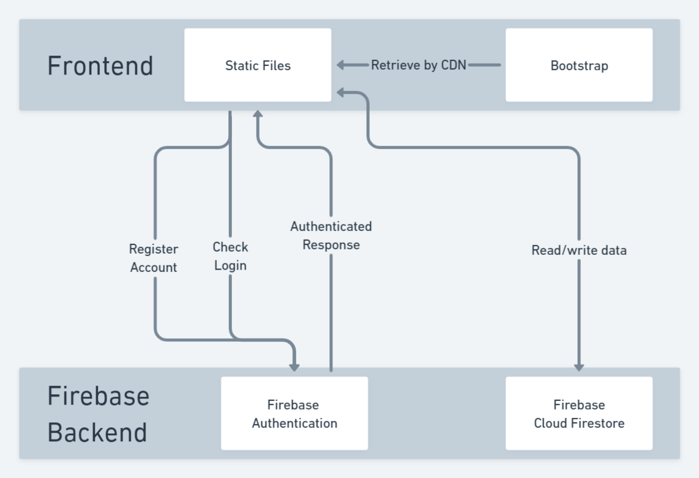
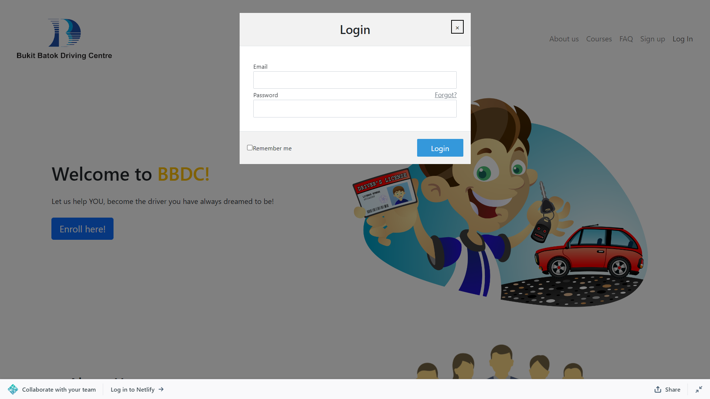
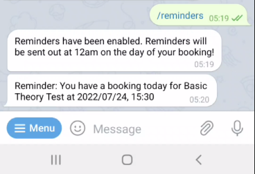

# Kachow! Documentation

- [Kachow! Documentation](#kachow-documentation)
- [1.1 Project Ideation](#11-project-ideation)
	- [1.1 Projected Level of Achievement](#11-projected-level-of-achievement)
	- [1.2. Motivation](#12-motivation)
	- [1.3. Aim](#13-aim)
	- [1.4 User Stories](#14-user-stories)
		- [1.4.1 Core User Stories](#141-core-user-stories)
		- [1.4.2 Extensions](#142-extensions)
- [2. Project Design](#2-project-design)
	- [2.1 Core Features](#21-core-features)
	- [2.2 Extensions](#22-extensions)
	- [2.3 Tech Stack](#23-tech-stack)
	- [2.4 User Workflow Diagram](#24-user-workflow-diagram)
	- [2.5 Web Component Diagram](#25-web-component-diagram)
- [3. Timeline and Development Plan](#3-timeline-and-development-plan)
- [4. Technical Proof of Concept](#4-technical-proof-of-concept)
	- [4.1 Student Workflow](#41-student-workflow)
	- [4.2 Telegram Bot Workflow](#42-telegram-bot-workflow)
	- [4.3 Admin Workflow](#43-admin-workflow)
- [5. Technical Documentation](#5-technical-documentation)
	- [5.1 Firebase Authentication](#51-firebase-authentication)
	- [5.2 Cloud Firestore Database](#52-cloud-firestore-database)
	- [Accounts Table](#accounts-table)
	- [Booking Table](#booking-table)
	- [Records Table](#records-table)
	- [Chats Table](#chats-table)
	- [5.3 Security](#53-security)
- [6. Testing](#6-testing)
	- [6.1 Manual Testing](#61-manual-testing)
	- [6.2 User Acceptance Testing](#62-user-acceptance-testing)
	- [6.3 Unit Testing](#63-unit-testing)
- [7. Software Design Principles](#7-software-design-principles)
	- [7.1 Separation of Concerns Principles](#71-separation-of-concerns-principles)
	- [7.2 Single Responsibility Principle](#72-single-responsibility-principle)
- [8. Software Engineering Practices](#8-software-engineering-practices)
	- [8.1 Branching](#81-branching)
	- [8.2 Github Issues](#82-github-issues)
	- [8.3 Pull Requests (PRs) and Review Workflow](#83-pull-requests-prs-and-review-workflow)
	- [8.4 Continuous Integration / Continuous Delivery (CI/CD)](#84-continuous-integration--continuous-delivery-cicd)
- [9. Challenges Faced and Future Work](#9-challenges-faced-and-future-work)
	- [9.1 Issues from Milestone 2:](#91-issues-from-milestone-2)
	- [9.2 Further Extensions:](#92-further-extensions)
- [Other Links](#other-links)

# 1.1 Project Ideation

## 1.1 Projected Level of Achievement
Apollo 11

## 1.2. Motivation
While learning to obtain our driving licenses, we had the *absolute pleasure* of utilizing  the *well-designed* and *up-to-date* online portals to do lesson/test bookings at Bukit Batok Driving Centre (BBDC). 

Its old, unintuitive and poor design choices impeded our experience in using the web portals, which caused great inconvenience and lots of frustration in the process.

## 1.3. Aim
We wish to **streamline and improve the lesson/test booking experience** of  **students in driving centres** in Singapore. Using the current BBDC booking portal as a starting point, we aim to:

(1) **design and implement a better web application for driving centres** 
to facilitate test/lesson bookings, and 

(2) add **quality-of-life improvements** to the web application to improve the learning experience of driving students.

## 1.4 User Stories

### 1.4.1 Core User Stories
1. As an **incoming student** enrolling into the driving school, I want to **create an account** easily.
2. As a **student**, I want to **update my profile details** and **check my account balance** easily.
3. As a **student**, I wish to **make lesson/test bookings** for Theory Tests (BTT/FTT); Practicals (Lessons/Tests) and Simulator Lessons (Sim 1-3).
4. As a **student**, I want to be able to **cancel or trysell my lesson/circuit slot**.
5. As a **student**, I want to have an **overview of my upcoming bookings/lessons**.
6. As an **administrator**, I wish to **manage the accounts of students in the driving school** to update their information (particulars, account balance) and allow them to pay for their lesson bookings.

### 1.4.2 Extensions
1. As a student, I want to have any **driving-related questions answered by my peers or instructors** to aid in my learning. 
2. As a student, I want to **get reminders** of my upcoming lessons/bookings.
3. As a user of the platform, I want to **clarify my doubts on how to use the platform** easily.
4. As a student, I want to be able to **perform account top-ups** using the platform.

# 2. Project Design
We aim to create a web application that will perform basic administrative features for students of BBDC, as well as a Telegram Bot and web forum to supplement the learning experience of students.

## 2.1 Core Features
**Web Portal:** 
 - Register for a student account with the driving school
 -  Review and update user information
 - Make and review lesson/test bookings made via the platform
 - (ADMIN) Update user information and account balances

## 2.2 Extensions
**Telegram Bot:**
- Opt-in service
- Start a conversation through a button in the Web Portal
- Get an overview of upcoming bookings
- Set automated reminders for upcoming bookings

**Web Forum:**
- Make and edit forum posts to ask questions
- View posts & comments made by other students
- Answer queries made by other students

## 2.3 Tech Stack
**Web Application Frontend**
- HTML & Javascript
- Bootstrap 5 
> Bootstrap 5 provides much needed utiliy for styling and responsive design, allowing our web application to be used on both mobile and desktop viewports. This is especially important given that a majority of users will likely be utilizing the web application from their phones.

**Backend & Database**
- Firebase
> In particular, we made use of Cloud Firestore for our database and Firebase Authentication for user authentication for our web application. Currently, only email/password authentication is supported, but it is possible to extend to other service providers such as Google.

**Hosting & CI/CD**
- Netlify (Web App Hosting Platform)
> Netlify is an easy to use platform. Furthermore, it is well integrated with Github and supports additional features such as Deploy Previews, which aid in the testing process.

**Telegram Bot**
- Node.JS
> We chose Node.JS as firebase has good support for Node.js and is capable of linking to Cloud Firestore, unlike other alternatives like Python.
>
> We also utilize `Telegraf`  which acts as a wrapper for the Telegram Bot API, and `node-schedule` which helps to automate sending reminder messages via Telegram.

## 2.4 User Workflow Diagram


**Login:** Users can easily register for an account using their email address and log into Kachow BBDC.

**Dashboard:** Once logged in, students can view a list of upcoming lesson bookings in ascending order of time.

**Make Bookings:** Students can select the type of booking, then select their desired timeslot for the lesson.

**Web Forum:** Users can log into the forum, make posts to ask questions, and comment on posts to answer their peers' queries.

**My Account:** Users can review their account information and link their account to Kachow BBDC's Telegram bot. 
*Note: For more information on the Telegram bot, visit the bot's [repo](github.com/charleslimjh/KachowTelebot).*

**Update Account:** Users can update certain personal particulars, such as their email, contact number and address.

## 2.5 Web Component Diagram


Kachow! is a simple web application mainly built on static web pages.

When a HTTP request is sent through the browser, Netlify will return the static web pages accessed. Bootstrap libraries are then retrieved via Content Delivery Network (CDN) by the client.

On restricted pages (student portal pages),  the client checks if the user is logged in by sending API calls to Firebase Authentication. Only when the user is authenticated will the content of the page be displayed. Users are redirected to `index.html` if they are not logged in.

To retrieve/write data to our database, the client will send API calls to Cloud Firestore. Firebase will then return the queried data or write the new data to the database respectively.

# 3. Timeline and Development Plan

|Milestone|Date|Task|
|---|---|---|
|Splashdown|9/5 - 15/5| Project Ideation + Video/Poster Creation|
|M1|16/5 - 22/5|Prototyping with Figma + Start learning necessary technologies|
|M1| 23/5 - 29/5 | HTML Web Application with login authentication, integrated with Firebase, and hosted on Netlify |
|M2|30/5 - 5/6|Learn technologies + address peer evaluation and peer feedback|
|M2|6/6 - 19/6|CRUD Functionality for Profiles, Bookings and Account Balances|
|M2|20/6 - 26/6|User Testing, start implementing Telegram Bot|
|M3|27/6 - 3/7|Finish Telegram Bot + Bug Fixes|
|M3|4/7 - 10/7|Web Forum Integration + Bug Fixes|
|M3|11/7 - 17/7|Unit/Integration/Manual Testing|
|M3|18/7 - 24/7|User Testing|

# 4. Technical Proof of Concept

We have implemented the following features:

1. BBDC Home Page
2. Account Registration Page
3. Log In Modals (in both Home and Registration Page)
4. BBDC Portal Main Page
5. My Account Page & Account Update Page
6. New Booking Page

## 4.1 Student Workflow

The Home Page contains some information about BBDC and some FAQs. Users can click on the "Sign Up" button in the Navbar or click on the blue "Enroll now!" button to register for an account.


Fill in the form to register for an account.


Click on the Log In button in the navbar to enter your account details into the Modal to sign in.


If you forget your password, click on the *Forgot?* link and fill in your email in this form.


The student portal's homepage displays your Name and a list of upcoming bookings, sorted in ascending order of time of booking.


Click on "My Account" in the navbar to view your account details. You can  click on the "Link to Telegram" button to trigger the set up process for the Telegram Bot. You can also click on "Update Particulars" to be redirected to a form to Update your personal particulars.
- 

Click on "Booking" in the navbar to start the booking process. Select a type of booking from the 3 dropdown menus provided.


Review that you have selected the correct type of booking, then select a date and time using the datetime picker.


You should then be redirected to a confirmation page should your booking be successful.


Click on the 'Forum' page to be redirected to the web forum. Create a user account with the web forum.


Make posts to ask any queries or comment on other users' posts to answer their queries instead.


## 4.2 Telegram Bot Workflow
Click on the "Link to Telegram" button to be redirected to Telegram.


Start the conversation with the bot, which will detect that you are a registered user of the website.


The `/bookings` command will list all your upcoming bookings.


The `/reminders` command will check whether reminders are enabled or not, and prompt you if you wish to toggle the option. Click on the inline keyboard to set up reminders.


Reminders will usually be sent around midnight.



## 4.3 Admin Workflow
Administrators can manage user accounts and information from the Firebase console.

In the Firebase Authentication tab, administrators can disable accounts, delete users and reset the passwords of users.


In the Firestore Database tab, administrators can manage the information of users by directly editing the database.


# 5. Technical Documentation
We make use of two services from Firebase: Firebase Authentication and Cloud Firestore.  We utilize Firebase's modular V9 SDK which provides reduced SDK size and greater efficiency.

For the web application, we add Firebase's Web SDK through Content Delivery Network (CDN) given that this is a simple project that does not require any build tools like webpack or Rollup. We import the various libraries and services in each web page's respective JavaScript file.

For front-end styling, we also import Bootstrap v5 and its required dependencies via CDN as well for the same reason above.

## 5.1 Firebase Authentication
We rely on Firebase's **Firebase Authentication** to handle account registration, log in and log out. Firebase Authentication is also capable of sending password reset emails.

We utilize email and password authentication as it is the most suitable one for our application. Firebase Authentication also checks whether the user is currently logged in for the applicable pages.

The API Javascript function calls are called in the respective pages' javascript files. The calls utilized are listed below:

|API Call|Params|Description|
| :-----: | :----: | :-----: |
|createUserWith EmailAndPassword()|**email**,<br>**password**|Creates a new user given the provided email-password pair|
|signInWith EmailAndPassword()| **email**,<br>**password** | Authenticates the email-password pair and signs the user in if they are a valid user. |
|signOut()|NIL|Signs out the current user.|
|onStateAuthChanged()|NIL| Attaches an observer object that obtains information on the currently logged in user.|
|sendPasswordResetEmail()| **email**|Sends an email to the user to reset their password, if they are a registered user.|


More information can be found at Firebase Authentication's Documentation found [here](https://firebase.google.com/docs/auth/web/password-auth).

## 5.2 Cloud Firestore Database
We rely on Firebase's **Cloud Firestore** to store information on users and booking information.

We utilise 3 different tables, (1) **accounts**, (2) **bookings** and (3) **chats**. We also make use of Firestore's [Collection Groups](https://firebase.google.com/docs/firestore/query-data/queries#collection-group-query) to implement the **bookings** table to facilitate querying bookings between categories (theory, simulator, practical).

## Accounts Table
This stores the student's particulars.
| FieldName | Data Type |Description|Example|
| :-------: | :-------: | :-------: | :-------:|
|ID|id|Autogenerated userId|yDSGKneuBd83u2n|
|email|string|Email of user|xinyu@domain.com|
|firstName|string|First name of user|Xin Yu|
|lastName|string|Last name of user|Wang|
|dob|string|User's Date of Birth|2001-01-01|
|gender|string|Gender of user|Female|
|phone|string|Contact number of user|98765432|
|course|string|Driving Course user is enrolled in|Class 2A|
|address|string|Residential address of user| 13 Computing Drive |
|postal|string| Postal code of user's address |117417|

## Booking Table
The booking table contains 3 documents: **practicals**, **simulators** & **theory**, each keeping track of the current booking number for that category. Each document links to a **records** collection group. 
``` 
Booking {
  practicals: {
    // booking number starts with 1
    bookingNo: 1000001,
    records: {
      ...
    }
  },
  simulators: {
    // booking number starts with 2
    bookingNo: 2000001,
    records: {
      ...
    }
  },
  theory: {
    // booking number starts with 3
    bookingNo: 3000001,
    records: {
      ...
    }
  }
}
```

## Records Table
This stores the individual booking data of each lesson/test booking. Datetimes are stored as a string in YYYY/MM/DD, HH:MM format to facilitate sorting.
|  FieldName  | Data Type |Description|Example|
| :---------: | :---------:| :---------:| :---------:|
|ID|id| Booking Number is used as document ID |1000001|
|bookingDesc|string|Type of lesson/test booked|BTT|
|datetime|string|Date and Time of Booking|2022/07/01, 15:00|
|user|string|UserId of user that made the booking|yDSGKneuBd83u2n|

## Chats Table
This stores the users that have subscribed to the Telegram Bot.
|  FieldName  | Data Type |Description|Example|
| :---------: | :---------:| :---------:| :---------:|
|ID|id| Telegram userId used as document ID |3123456789|
|reminders|boolean|Checks if user has enabled reminders|true/false|
|telegramUser|string|Telegram username of user|@user_name|
|user|string|UserId (in accounts table) of user that made the booking|yDSGKneuBd83u2n|

## 5.3 Security
Firebase Authentication checks if the user is logged in before displaying any web content. If the user is not logged in, the user will automatically be redirected back to index.html. Firebase Authentication handles the hashing and secure storage of passwords, which are not viewable even to administrators.

Cloud Firestore also has security rules in place which only allow registered users to read and write data to Cloud Firestore. In the future, more specific security rules can be implemented to allow users to only write/view documents that are tagged to their account.

# 6. Testing

## 6.1 Manual Testing

## 6.2 User Acceptance Testing
We surveyed 15 users who are students/alumni of BBDC. We walked through the app with them and conducted an interview with them, inquiring on the following features:

**Overall**
- Is the app intuitive and easy to use?
- Are the features sufficient? What else would you like to see in the app?

**Registration/Login**
- Is the login/registration process easy?
- Is it easy to reset your password? Does the feature work well?

**Bookings**
- Are the 3 dropdown menus easy to understand and effective?
- Is it easy to select dates and times?
- Are the bookings displayed accurately and in an intuitive way?

**Forum**
- Is it simple to use the forum (make posts, make comments)?
- Is it acceptable to be redirected to an external platform?
- Would the forum be beneficial to students of BBDC in terms of their learning?

**Telegram Bot**
- Is it difficult to set up the Telegram bot?
- Are the reminders function useful?

The results of the interviews can be found in this [spreadsheet](https://docs.google.com/spreadsheets/d/15KIjIOQ-JXxQaFujBL1RgQek3loMWcFEWfjTsPxXfO4/edit#gid=0).

## 6.3 Unit Testing
Automated unit testing on static HTML pages was achieved by using Selenium IDE for Chrome. We focused on checking the links between pages to make sure that they work on the various web pages. The files can be found in the `selenium-tests` folder. For more information on Selenium IDE, you can refer to their website [here](https://www.selenium.dev/selenium-ide/).

For the Telegram bot, we utilized the `telegraf-test` library to conduct some simple unit tests. The test files can be found in KachowTelebot's [repo](https://github.com/charleslimjh/KachowTelebot). More information on `telegraf-test` can be found at the library's Github [repo](https://github.com/TiagoDanin/Telegraf-Test).


# 7. Software Design Principles
The following lists some of the software design principles adopted in this project, with reference to the CS2103/T Online Textbook linked [here](https://nus-cs2103-ay2021s1.github.io/website/se-book-adapted/index.html).

## 7.1 Separation of Concerns Principles
> **Separation of concerns principle (SoC)**: To achieve better modularity, separate the code into distinct sections, such that each section addresses a separate _concern_. -- Proposed by [Edsger W. Dijkstra](https://en.wikipedia.org/wiki/Edsger_W._Dijkstra)

Given the deeply nested structure of HTML, we found that it was of utmost importance to structure our code properly so that we could identify components easily and quickly make changes. Each component was sectioned properly and well commented so that the necessary changes could be made quickly.

This principle was also utilized when creating the Telegram bot. For example, we separated the toggling of reminders into 2 separate functions, one for checking if the user has enabled reminders and one for the toggling of reminders.
```
async  function reminders(ctx) {
	// check if reminders are enabled for user
	var isReminder = await db
		.collection("chats")
		.doc(ctx.message.chat.id.toString())
		.get();

	isReminder = isReminder.data().reminders;
	if (isReminder) {
		ctx.reply("Reminders are on. Would you like to turn them off?",
			Markup.inlineKeyboard([
				Markup.button.callback("Turn off reminders", "disableReminders"),
				Markup.button.callback("Cancel", "cancel"),
			])
		);
	} else {
		ctx.reply("Reminders are off. Would you like to turn them on?",
			Markup.inlineKeyboard([
				Markup.button.callback("Turn on reminders", "enableReminders"),
				Markup.button.callback("Cancel", "cancel"),
			])
		);
	}
}

bot.command("reminders", (ctx) => reminders(ctx));
bot.action("enableReminders", (ctx) => enableReminder(ctx));
bot.action("disableReminders", (ctx) => disableReminder(ctx));
```

## 7.2 Single Responsibility Principle
>   **Single responsibility principle (SRP)**: A class should have one, and only one, reason to change.  -- Robert C. Martin

Each component and function should only serve one specific purpose. This will help minimise changes. With that in mind, each component has a dedicated function for each EventListener and each function only handles one specific functionality in one specific function.

With reference to the same Telegram bot code snippet above, each function written handles one specific part of the entire toggleReminder process, one function to handle the querying of users, one to enable reminders, and one to disable reminders.

# 8. Software Engineering Practices
We detail our software engineering practices used in this project, namely version control with Git.

## 8.1 Branching 
We utilized branching in Git. We created one "main" branch for each milestone (e.g. `milestone2`, `milestone3`) which then branches off to 2 separate branches for the 2 collaborators: *crud-frontend* (for Xin Yu) and *crud-backend* (for Charles). By working on our own branches instead of working on *main*, we avoid any unintended code updates to the master branch.

## 8.2 Github Issues
We utilize Github Issues after getting our minimum viable product (MVP) out in Milestone 2. We kept track of new bugs and simultaneously assigned one collaborator to be in charge of the edit.

## 8.3 Pull Requests (PRs) and Review Workflow
Workflow:
1. A collaborator starts by checking out to their specific branch and making commits to their personal branch.
2. After pushing their commits to Github, the collaborator makes a pull request (PR) to the `milestoneX` branch.
3. The other collaborator then reviews the code and makes any comments as necessary.
4. When satisfied with the changes, the collaborator approves the PR and merges the changes to `milestoneX`. The collaborator then pulls these changes from the `milestoneX` branch.

This ensures that there is ample communication between parties such that everyone is aware with each other's development progress and avoid unwanted code pushes to main.

Furthermore, using Netlify's feature of *Deploy Previews*, we are able to test all code for Milestone 2 before pushing it to `main`, allowing us to perform user acceptance testing and one final round of manual testing before we push the code to `main`.

## 8.4 Continuous Integration / Continuous Delivery (CI/CD)

We set up CI/CD with Netlify by enabling the *Deploy Previews* feature. A Deploy Preview is triggered every time a PR is made, which automatically checks if the app is deployable on Netlify by building and hosting the web application. The collaborator can utliize the Deploy Preview to conveniently test the application before approving PRs. 

# 9. Challenges Faced and Future Work

## 9.1 Issues from Milestone 2:
- There are styling issues with the navbars, especially on mobile viewports. 
	- This has been addressed in Milestone 3.
- We faced difficulties in implementing the Telegram Bot for reminders on test/lesson bookings due to a lack of support for Cloud Firestore on Python. 
	- As such, we have transited to building our bot on Node.JS instead, which can be found [here](github.com/charleslimjh/KachowTelebot).
- When a user updates their email, the user's existing bookings are not updated and are lost unless they revert back to their original email. 
	- This backend issue has been addressed in Milestone 3, after restructuring the database and generating unique IDs for every student.


## 9.2 Further Extensions:
- We have considered an AskJamie-styled Help Chatbot in our web application that would answer any FAQs on how to use the platform. This was not pursued in Orbital but would make an excellent extension to the web application.
- We have received feedback that account top-ups are a crucial feature to users of our platform. We regretably did not pursue this feature due to time constraints.
- More stringent database security rules can be enforced in the Firebase console. 
- We also plan to look into booking cancellation features, including a *trysell* feature that allows students to sell their slots to other students.
- Additional configuration can be done for the web forum such that the user accounts for the BBDC portal can also be used for web forum, instead of having to create a separate account for the platform.

# Other Links
- [Figma Prototype (Unfinished Draft)](https://www.figma.com/proto/2vEriPljl65Etd0ZpulQhw/Kachow!?node-id=221%3A1919&scaling=scale-down&page-id=221%3A1890&starting-point-node-id=221%3A1919&show-proto-sidebar=1)
